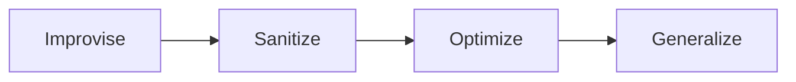

# AI Show & Tell

## Principles

* Constrain the AI to only give right answers (Make it work)
* Reward code quality (Make it right)
* Enable optimization (Make it fast)
* Increase optionality (Make it general)



## Strategies

* Test-first
* Make build steps easily discoverable
* Automate quality checks
* Enforce compliance

## Tactics

* Use [nWave](<https://nwave.ai/>)
* Use `make` as a project-level CLI
* Use pre-commit hooks to prevent bad commits
* Use code quality metrics as feedback
* Use code coverage and mutation testing to manage test quality
* Ensure README.md is complete and up to date

## Demo

### Greenfield

Use `/nw-discover` and/or `/nw-diverge`

#### Greenfield Procedure

Create a new directory and initialize as a git repository:

```shell
mkdir tic-tac-toe
cd tic-tac-toe
git init
```

Open Claude Code and type:

```text
/nw-discover I want to develop a web-based tic-tac-toe game.
```

### Brownfield

Use `/nw-discuss`

### Troubleshooting

Use `/nw-root-why`

## References

* [Jobs to Be Done Theory](https://www.christenseninstitute.org/theory/jobs-to-be-done/)
* [Jobs to Be Done: Theory to Practice](https://www.amazon.com/Jobs-be-Done-Theory-Practice/dp/0990576744)
* [Mom Test methodology](https://tldv.io/blog/the-mom-test/)
