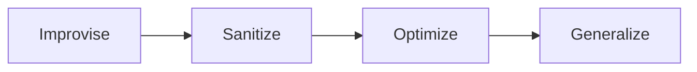

# AI Show & Tell

Using a language model to develop software can make you more efficient, but it can also lead you down some dark alleys.  When engaging an LLM, consider that it needs what you need - a clear understanding of the problem to solve, methods that produce repeatable results, and a process that standardizes work and therefore reduces variance.

## Principles

* Constrain the AI to only give right answers (Make it work)
* Reward code quality (Make it right)
* Enable optimization (Make it fast, cheap, memory efficient, more profitable, etc...)
* Increase optionality (Make it more generally applicable, adaptable to new situations)



## Strategies

* Test-first
* Make build steps easily discoverable
* Automate quality checks
* Enforce compliance

## Tactics

* Use [nWave](<https://nwave.ai/>)
* Use `make` as a project-level CLI
* Use pre-commit and pre-push hooks to prevent escaped defects
* Use code quality metrics as feedback
* Use code coverage and mutation testing to manage test quality
* Ensure README.md is complete and up to date

## Demo

### Greenfield

Use `/nw-discover` and/or `/nw-diverge`

#### Worked Example — Tic-Tac-Toe

A greenfield SPA built end-to-end through the full nWave flow (DISCOVER → DISCUSS → DESIGN → DISTILL → DELIVER → DEVOPS) as a methodology practice project. Zero-backend, accessible (WCAG 2.2 AA, axe-core enforced), functional-paradigm TypeScript with ports-and-adapters; pure core at 100% mutation kill rate (Stryker), DOM-entangled adapters covered by Playwright; bundle capped at 45 KB gzipped, deployed to GitHub Pages via a make-driven CI pipeline.

* Repository: <https://github.com/dale-stewart/tic-tac-toe>
* Live app: <https://dale-stewart.github.io/tic-tac-toe/>

#### Greenfield Procedure

Create a new directory and initialize as a git repository:

```shell
mkdir tic-tac-toe
cd tic-tac-toe
git init
```

Open Claude Code and type:

```text
/nw-discover I want to develop a web-based tic-tac-toe game.
```

### Brownfield

Use `/nw-discuss`

### Troubleshooting

Use `/nw-root-why`

## References

* [Jobs to Be Done Theory](https://www.christenseninstitute.org/theory/jobs-to-be-done/)
* [Jobs to Be Done: Theory to Practice](https://www.amazon.com/Jobs-be-Done-Theory-Practice/dp/0990576744)
* [Mom Test methodology](https://tldv.io/blog/the-mom-test/)
* [Five whys root cause analysis](https://web.archive.org/web/20221127052017/https://www.toyota-myanmar.com/about-toyota/toyota-traditions/quality/ask-why-five-times-about-every-matter)
* [Mutation Testing](https://blog.cleancoder.com/uncle-bob/2016/06/10/MutationTesting.html)
